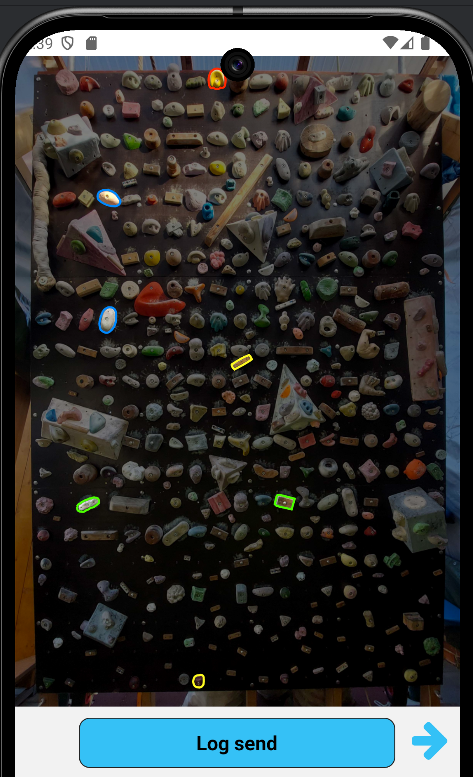
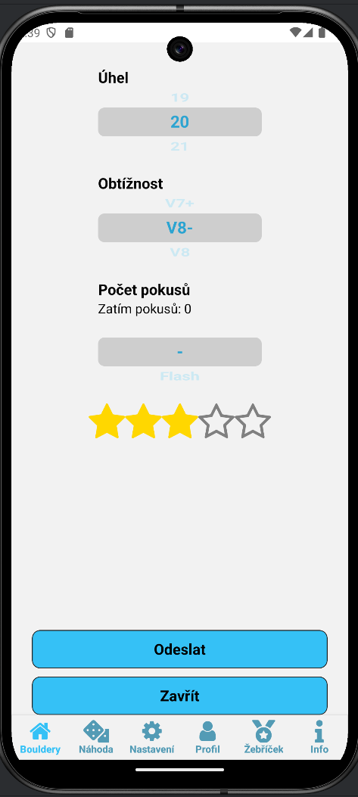
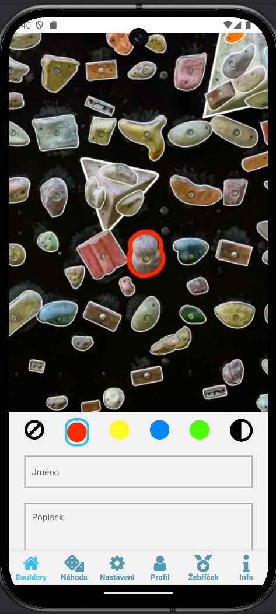

# GarageBouldering

Garage bouldering is a ReactNative app for creating, viewing and logging boulder problems on a custom bouldering wall.

## Specification

### The app

The app contains multiple pages
1. Home page - with a list of available boulder problems, by clicking on a problem, the user is taken to details page
2. Details page - contains an image of the bouldering wall with highlighted holds belonging to the problem, 
the average perceived difficulty and a button for logging a send (send means completing the problem)
3. Log send page - lets the user log the number of attempts and perceived difficulty of the problem to a database
4. Send list - contains a list of every user's sends
5. Create boulder - lets user interactively by tapping at holds build and save a new boulder problem
6. Ranking - shows users ranking by awarding points based on difficulty of sent boulders
7. Setting page - lets user filter boulder problems by different attributes

The app is written using [Expo framework](https://docs.expo.dev/get-started/introduction/) - ReactNative and TypeScript. It is mainly aimed to be built for android.

For development WebStorm IDE is used and Android Studio for testing the app on emulators. Developing the app should be possible on
both Windows and Linux.

Different packages are used from npm, all of them are listed in the package.json file.

The app was tested on emulators with all android versions from 7 to 14 and on a real devices with androids 7, 7.1.1, 9 and 14.

### The backend

A web backend is needed for the app to function, it's specification can be found [here](https://github.com/pepanzdorf/GarageClimbingAPI)

## Installation

First the backend API needs to be setup by following the [readme](https://github.com/pepanzdorf/GarageClimbingAPI).

Then change the `apiURL` variable to the correct URL in [Other.ts](./constants/Other.ts)

### Build APK locally using Expo Application Services (EAS)

```bash
npx eas-cli@latest build --platform android --profile production --local
```

Then install the apk on your device.

### Build a Signed APK without EAS


This command creates android folder in the root of the project.
```bash
expo prebuild
```

Follow [React Native guide](https://reactnative.dev/docs/signed-apk-android) to create a keystore and add it to the project.
Follow the guide until Generating the release AAB heading (excluded).

Then build the release apk using the following command inside the `android` folder:

```bash
./gradlew assembleRelease
```

or by using expo cli:

```bash
expo run:android --variant release
```

The apk should be found at `android/app/build/outputs/apk/release/app-release.apk`.

Lastly install the apk on your device.

# Images




